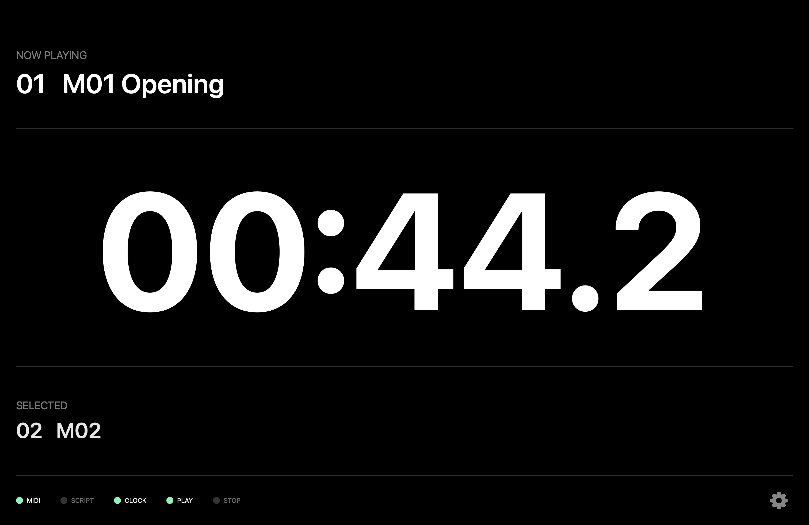
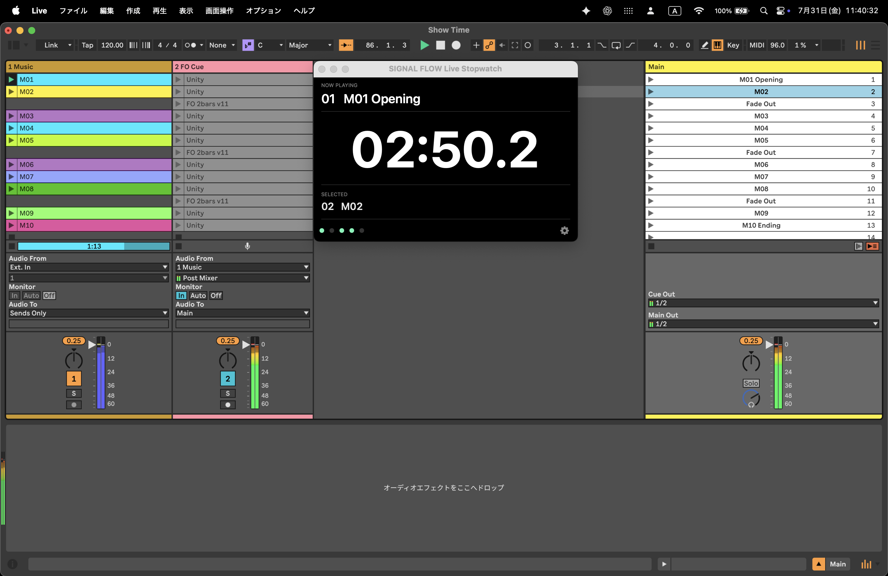

# SIGNAL FLOW Live Stopwatch

Professional macOS utility for Ableton Live show operation.

> Apple Developer ID Signed  
> Apple Notarized  
> Universal Binary (Intel / Apple Silicon)

---

## Overview

SIGNAL FLOW Live Stopwatch は、Ableton Liveを使用したライブ・イベントオペレーション向けに開発されたmacOS専用ストップウォッチです。

Ableton Liveの再生開始・停止と自動同期し、本番中でも常に視認しやすいタイマー表示を提供します。

実際のPA・イベント現場での運用を前提に設計されています。

## Requirements

- macOS 11 or later
- Ableton Live 12
- Intel / Apple Silicon
- Universal Binary
- IAC Driver
- SIGNAL FLOW Remote Script

## Features

- Automatic stopwatch synchronized with Ableton Live playback
- Automatic reset when Live stops
- Automatic restart when the playing clip changes
- Large countdown display for live operation
- NOW PLAYING display
- SELECTED clip display
- MIDI / SCRIPT / CLOCK / PLAY / STOP status indicators
- Always-on-top window
- Compact operation mode
- Automatic IAC Driver detection

## Installation

1. Download the latest release from the **Releases** page.
2. Open `SIGNAL FLOW Live Stopwatch.app`.
3. If Gatekeeper appears, choose **Open**.
4. Launch Ableton Live.
5. Enable the included SIGNAL FLOW Remote Script.

## Quick Start

1. Launch Ableton Live.
2. Load your Live Set.
3. Press **PLAY**.
4. SIGNAL FLOW Live Stopwatch starts automatically.
5. Stop playback to reset the timer.

## Screenshots

### Main Window

### Compact Mode

## Download

The latest signed and Apple Notarized version is available from the **Releases** page.

⬇️ [Download the latest release](../../releases/latest)
